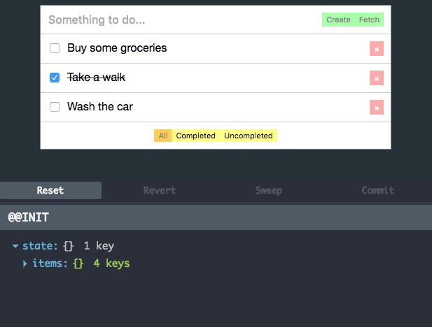

# react-webpack-redux-boilerplate
Minimal boilerplate for React + Redux with dev environment.

 - Dependencies
   - [React](https://github.com/facebook/react) (UI)
   - [Redux](https://github.com/rackt/redux) (State container)
   - [redux-thunk](https://github.com/gaearon/redux-thunk) (Function dispatching for Redux)
   - [react-redux](https://github.com/rackt/react-redux) (React bindings for React)


 - Developer tools
   - [Babel](https://github.com/babel/babel-loader) (ES2015 and JSX transpiler)
   - [Webpack](https://github.com/webpack/webpack) (Module bundler)
   - [webpack-dev-server](https://github.com/webpack/webpack-dev-server) (Web server with Hot Module Replacement for development usage)
   - [eslint](https://github.com/eslint/eslint) and [csslint](https://github.com/CSSLint/csslint) (Source code linters)
   - [redux-devtools](https://github.com/gaearon/redux-devtools) (A live-editing time travel environment for Redux)


## Example



This boilerplate contains a simple "Todo" application using recommended patterns from React and Redux documentation. Reducers and action dispatchers has been written according to [ducks-module-redux](https://github.com/erikras/ducks-modular-redux) proposal, using a self-contained state handler in a "duck" file for every global state piece.

## Usage
```
npm install
npm start
```
Go to http://localhost:8080

## Linting
```
npm run lint      # All
npm run lint:js   # Javascript
npm run lint:css  # CSS
```

## Build
```
npm run build
```
It builds full project to `dist` folder. Then you can copy this folder content to use it with your favourite static web server (Apache, Nginx, etc.).
